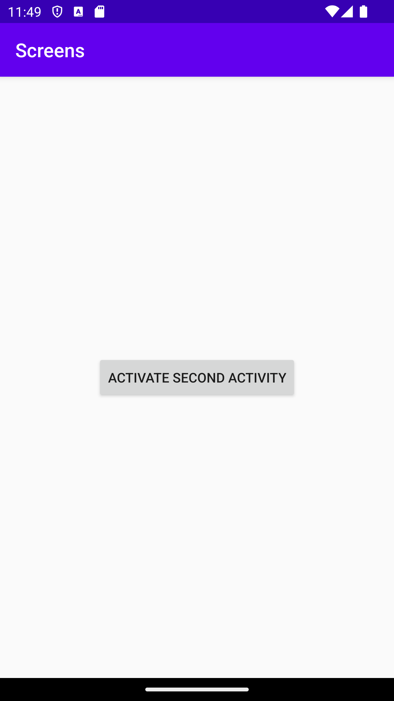

# Rapport

At first I simply added the files for the second activity without changing them. After ensuring that they were both properly accounted for I added the startSecond function to MainActivity.java along with a corresponding button
in activity_main.xml, making use of android:onClick="startSecond" in order to start the function when the button was clicked. Initially I added both Intent i = new Intent(MainActivity.this, SecondActivity.class); and
Bundle extras = getIntent().getExtras(); in startSecond, but I later on saw my mistake and moved the bundle to SecondActivity.java, where it was intended to be. I also made sure to add a simple layout with a dark grey
background in order to test if the button worked. After that I made sure to assign a piece of data to the intent, and replaced the dark grey layout in the second activity layout with a textview widget, which changed it's
string to the string that accompanied the Intent in the main file.

## Följande grundsyn gäller dugga-svar:

- Ett kortfattat svar är att föredra. Svar som är längre än en sida text (skärmdumpar och programkod exkluderat) är onödigt långt.
- Svaret skall ha minst en snutt programkod.
- Svaret skall inkludera en kort övergripande förklarande text som redogör för vad respektive snutt programkod gör eller som svarar på annan teorifråga.
- Svaret skall ha minst en skärmdump. Skärmdumpar skall illustrera exekvering av relevant programkod. Eventuell text i skärmdumpar måste vara läsbar.
- I de fall detta efterfrågas, dela upp delar av ditt svar i för- och nackdelar. Dina för- respektive nackdelar skall vara i form av punktlistor med kortare stycken (3-4 meningar).

Programkod ska se ut som exemplet nedan. Koden måste vara korrekt indenterad då den blir lättare att läsa vilket gör det lättare att hitta syntaktiska fel.

```
    public void startSecond(View view) {
        //Starts the second activity
        Intent i = new Intent(MainActivity.this, SecondActivity.class);
        i.putExtra("activityTxt", "The Second Activity has been activated"); //adds a piece of data with the activity
        startActivity(i);
    }
```

Bilder läggs i samma mapp som markdown-filen.



Läs gärna:

- Boulos, M.N.K., Warren, J., Gong, J. & Yue, P. (2010) Web GIS in practice VIII: HTML5 and the canvas element for interactive online mapping. International journal of health geographics 9, 14. Shin, Y. &
- Wunsche, B.C. (2013) A smartphone-based golf simulation exercise game for supporting arthritis patients. 2013 28th International Conference of Image and Vision Computing New Zealand (IVCNZ), IEEE, pp. 459–464.
- Wohlin, C., Runeson, P., Höst, M., Ohlsson, M.C., Regnell, B., Wesslén, A. (2012) Experimentation in Software Engineering, Berlin, Heidelberg: Springer Berlin Heidelberg.
